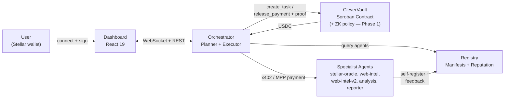
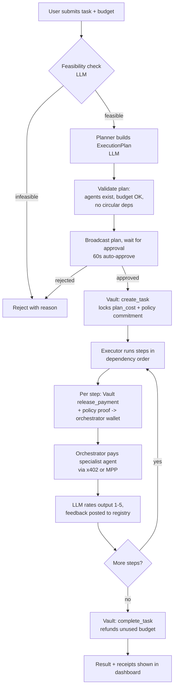
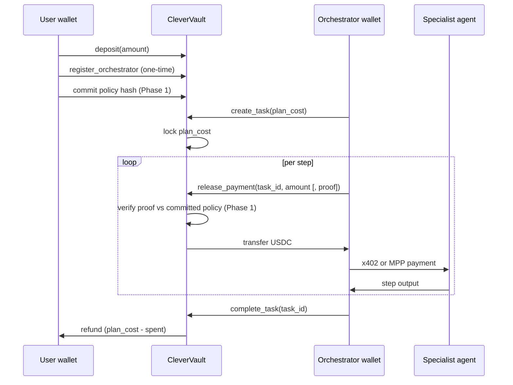

# Architecture

This document describes how CleverCon's pieces fit together today, and how the
architecture is expected to evolve per [ROADMAP.md](../ROADMAP.md).

CleverCon is a protocol for **private, policy-bounded delegation of money to AI
agents on Stellar**. A user locks USDC in a non-custodial Soroban vault under a
spending policy; an orchestrator hires specialist agents and pays them per step;
and — per Phase 1 of the roadmap — every release is bound by a zero-knowledge
proof that it complies with the user's private policy. This document marks
clearly what is live today versus what is grant-scope.

## System overview



## Components

| Package | Role |
|---|---|
| `packages/common` | Shared TypeScript types (`AgentManifest`, `AgentRecord`, `ExecutionPlan`, `TaskResult`, ...), Stellar network constants, a small logger, and wallet-loading helpers. Imported by every backend package. |
| `packages/registry` | Express API for agent discovery and reputation. Agents self-register on startup; the orchestrator queries it when building a plan; feedback after each job updates an agent's reputation score. Backed by a JSON file (`data/registry.json`). |
| `packages/orchestrator` | The core service. Plans tasks via an LLM (currently Claude Sonnet via the Anthropic API), validates and executes the plan, talks to CleverVault to lock/release funds, pays agents via x402/MPP, and serves the dashboard over REST + WebSocket. |
| `packages/dashboard` | React 19 + Vite + Tailwind frontend for connecting a wallet, funding the vault, submitting and approving tasks, and viewing history. |
| `packages/agents/*` | Five specialist agents (`stellar-oracle`, `web-intel`, `web-intel-v2`, `analysis`, `reporter`), each an Express server exposing a manifest, a `/health` endpoint, and a paid query endpoint. |
| `contracts/agent-vault` | **CleverVault** — the Soroban contract that holds user USDC and enforces the budget lifecycle on-chain. Phase 1 adds the zero-knowledge policy layer. |
| `contracts/budget-guardian` | An earlier, simpler budget-tracking contract. Not used by the current orchestrator (superseded by CleverVault); kept for historical reference. |

The zero-knowledge policy engine that Phase 1 integrates (RISC Zero guest
programs, a Groth16 verifier router, and the prover service) lives today in
[CipherMit](https://github.com/Bosun-Josh121/ciphermit), where it is already
deployed and demonstrated on Stellar testnet. It is not yet part of this
repository.

## Private policy enforcement (Phase 1)

The property that defines CleverCon is that a user's spending policy is both
**private** and **provably enforced on-chain**. This section describes the
target design; see [ROADMAP.md](../ROADMAP.md) Phase 1 for status.

At deposit/lock time, the user commits a spending policy as a cryptographic hash
(e.g. `sha256(rule || vault_secret)`) so the rule never appears on-chain in the
clear. Four policy types are supported:

| Policy | Enforces | Mechanism |
|---|---|---|
| **Allowance** | Rolling, time-windowed spending caps that refill (e.g. $2,000 / 30 days) | Committed cap + running total |
| **Allowlist** | Payment only to approved agents | Merkle membership proof |
| **Delegation** | Private per-orchestrator sub-budgets | Committed per-delegate caps |
| **Compliance** | Deny-list and threshold enforcement | Merkle non-membership + threshold |

When the orchestrator asks the vault to release a payment, it must present a
**Groth16 proof** (generated by a RISC Zero zkVM guest program) that the release
complies with the committed policy. The contract verifies the proof through a
Soroban verifier router before moving funds. The proof binds to the specific
recipient, amount, and owner (preventing substitution), uses **nullifiers** to
prevent replay, and pins the expected guest-program **image ID** so only proofs
from the exact program pass.

**Proving happens at authorization, not per micropayment.** ZK proving is
server-side and takes real time, which would be fatal for sub-cent x402 calls.
The design proves policy compliance for a task's plan when the budget is locked,
then allows fast per-step releases *within* the proven envelope. The boundary is
cryptographically enforced; the micropayments inside it stay instant.

## Trust model

CleverCon's trustlessness applies to specific layers of the system. Being clear
about this matters for users and contributors evaluating the platform.

### What is cryptographically enforced

- **USDC custody:** CleverVault holds all user funds. The contract is the only
  entity that can release payments. The operator cannot access user balances.
- **Per-step payment release:** payments release only after the specific step is
  executed and authorized, capped on-chain at the task's remaining budget. The
  operator cannot drain funds even if the orchestrator misbehaves.
- **Policy compliance (Phase 1):** once the ZK policy layer is integrated, no
  release can settle unless a proof shows it complies with the user's committed
  policy — and the policy itself is never revealed.
- **Settlement finality:** all payments are real Stellar transactions with
  verifiable hashes. No off-chain accounting, no IOUs.

This is a stronger position than custodial, backend-enforced agent wallets,
where a server holds the user's key and checks limits off-chain: there, both
custody and the spending rule live with the operator. In CleverCon, custody is
in the contract and the rule is enforced by proof.

### What currently requires trusting the operator

- **Task decomposition:** the orchestrator (run by the platform operator)
  decides how to break a task into steps. A malicious orchestrator could
  generate wasteful plans. Mitigations: plans are shown to users for explicit
  approval before execution; and once Phase 1 lands, a plan can only spend
  within the user's private, proof-enforced policy envelope.
- **Agent selection:** the orchestrator picks which specialist fills each step.
  Mitigation: selection logic is open-source and auditable; reputation scoring
  is transparent; the allowlist policy lets a user cryptographically restrict
  which agents can ever be paid.
- **Quality rating:** reputation updates are computed by an LLM rating service
  (currently Claude Haiku). The operator could influence ratings. Mitigation:
  the rating service is being refactored to support multiple providers; user-
  driven ratings weighted by on-chain history are on the roadmap.
- **Proving (Phase 1):** proofs are generated by a hosted prover service.
  Mitigation: the prover only attests to compliance and cannot move funds
  itself; decentralizing proving to a local/enclave prover is on the roadmap
  (Phase 6).

### Roadmap toward less trust

- **Phase 1:** private, proof-enforced spending policies remove the operator's
  ability to spend outside the user's committed rule.
- **Phase 3:** on-chain Agent Registry contract removes the registry as a
  centralized data point.
- **Phase 5+:** multi-orchestrator support lets third parties run their own
  orchestrators against the shared registry — bound by the same user policy.
- **Phase 6:** decentralized proving and a security audit.

CleverCon is more trustless than centralized/custodial AI-agent services
(custody, settlement, and — per Phase 1 — policy enforcement are on-chain) but
less trustless than a fully decentralized protocol (orchestration and proving
involve operator-run infrastructure). The roadmap progressively closes that gap.

## Task lifecycle



The current LLM implementation uses Claude Sonnet for planning and Claude Haiku
for feasibility checks and output rating. The provider is being decoupled behind
an interface (roadmap Phase 5). The proof step at `release_payment` is Phase 1;
today the release is capped on-chain but not yet policy-gated.

The full pipeline lives in `packages/orchestrator/src/server.ts`'s `runTask()`
and `packages/orchestrator/src/executor.ts`'s `PlanExecutor`.

## Fund flow — CleverVault

CleverVault (`contracts/agent-vault`) is a Soroban contract that holds USDC on
behalf of users. The orchestrator never custodies user funds beyond the brief
moment it takes to relay a per-step payment to a specialist agent.



### On-chain guarantees

| Guarantee | Enforcement |
|---|---|
| One active task at a time per user | `active_tasks_count == 0` required to start a task |
| No overspending | `release_payment` is capped at the task's remaining `plan_cost` |
| Policy compliance (Phase 1) | `release_payment` requires a valid Groth16 proof against the committed policy |
| No mid-task withdrawals | `active_tasks_count == 0` required to call `withdraw` |
| Unused budget refunded | `finalize_task` returns `plan_cost - spent` to the user automatically |
| Stuck task recovery | Anyone can call `force_complete_stale_task` after the stale threshold |
| Abort anytime | `cancel_task` (user-authorized) refunds remaining locked funds immediately |

### Contract data model

- `UserAccount` — per-asset `balance`, `locked`, `total_deposited`,
  `total_spent`, and `created_at`.
- `UserConfig` — user-wide settings: linked `orchestrator`,
  `orchestrator_name`, and `active_tasks_count`.
- `TaskInfo` — `user`, `orchestrator`, `plan_cost`, `spent`, `completed`,
  `created_at`, and `asset`.
- A reverse-lookup `OrchestratorOwner(orchestrator) -> user` lets the contract
  resolve which user's funds an orchestrator-authorized call should affect.

See the doc comments in
[`contracts/agent-vault/src/lib.rs`](../contracts/agent-vault/src/lib.rs) for
per-function parameters, return values, and authorization requirements.

## Payment protocols

### x402 — per-call HTTP micropayments

Used by `stellar-oracle`, `web-intel`, `web-intel-v2`, and `reporter`.

```
Orchestrator                          Specialist agent
     |-- POST /query ----------------->|
     |<-- 402 Payment Required --------|
     |    { amount: "0.02", currency: "USDC" }
     |                                  |
     |  [CleverVault releases funds to  |
     |   the orchestrator wallet]       |
     |                                  |
     |-- POST /query + X-Payment: <tx> >|
     |<-- 200 OK + data ---------------|
```

Implemented in `packages/orchestrator/src/x402-client.ts` (`makeX402Payment`),
built on `@x402/fetch` and `@x402/stellar`. Each attempt (up to 3, with
exponential backoff) uses a fresh signer to avoid stale Stellar sequence
numbers.

### MPP — streaming session payments

Used by `analysis`. Opens a pre-authorized payment session and settles the
actual amount used at the end of the call.

```
Orchestrator                          AnalysisBot
     |-- open MPP session (auth amount) ->|
     |<-- stream output ----------------  |
     |-- settle: actual amount used ----->|
     |   (difference returned to vault)   |
```

Implemented in `packages/orchestrator/src/mpp-client.ts` (`makeMPPPayment`),
built on `mppx` / `@stellar/mpp`.

## Agent selection and reputation

Two related but distinct scoring calculations exist:

1. **Reputation score** (`packages/registry/src/reputation.ts`,
   `calculateScore`) — a 0-100 score stored on each `AgentRecord`, recomputed
   after every job from cumulative feedback:

   | Factor | Weight |
   |---|---|
   | Success rate | 40% |
   | Average quality rating (1-5) | 35% |
   | Speed (latency-based) | 15% |
   | Experience bonus (jobs completed, capped at 50) | 10% |

2. **Agent selection score** (`packages/orchestrator/src/selector.ts`,
   `scoreAgents`) — used by the orchestrator when choosing which agent fills a
   plan step:

   | Factor | Weight |
   |---|---|
   | Capability match | 35% |
   | Reputation score (from above) | 30% |
   | Price efficiency | 15% |
   | Latency | 10% |
   | Discovery bonus (agents with < 5 jobs) | 10% |

After each step, `packages/orchestrator/src/rater.ts` asks the configured LLM to
rate the output 1-5 (defaulting to 3 on error), and
`packages/orchestrator/src/executor.ts` posts that feedback to the registry's
`POST /feedback` endpoint, which feeds back into the reputation score. Under the
allowlist policy (Phase 1), selection is additionally constrained to the agents
the user has cryptographically approved.

## Data persistence

The registry and orchestrator persist state as JSON files under `data/`
(gitignored, created at runtime):

| File | Written by | Contents |
|---|---|---|
| `data/registry.json` | `packages/registry/src/store.ts` | Agent manifests and reputation |
| `data/orchestrators.json` | `packages/orchestrator/src/orchestrator-store.ts` | Per-user orchestrator wallet records, **including secret keys in plaintext** (a known pre-production gap — see [SECURITY.md](../SECURITY.md)) |
| `data/vault-ledger.json` | `packages/orchestrator/src/vault-ledger.ts` | Deposit/withdrawal/payment ledger for the dashboard |
| `data/activity-log.json` | `packages/orchestrator/src/activity-store.ts` | Recent task lifecycle events, used for the activity feed and pulse stats |
| `data/task-results.json` | `packages/orchestrator/src/task-results.ts` | Completed task results (prompt, steps, output, cost) |

None of these stores currently have file-locking, so concurrent writes can
race — see the open issues for planned fixes.

## Future architecture

Per [ROADMAP.md](../ROADMAP.md), the next phases move toward:

- **Private policy enforcement** (Phase 1): the ZK policy layer integrated into
  CleverVault so spending is provably bounded and the rule stays private.
- An **on-chain Agent Registry contract** (Soroban), so agent manifests and
  reputation are independently verifiable rather than living in a single
  service's JSON file.
- A **Stellar MCP server**, exposing registry discovery and vault read views as
  MCP tools so any MCP-compatible client can find and pay CleverCon agents.
- A **specialist Agent SDK** (`@clevercon/agent-sdk`) that packages the x402/MPP
  scaffolding, manifest/health endpoints, and self-registration currently
  duplicated across `packages/agents/*`.
- A **pluggable LLM provider interface** that decouples the orchestrator from
  the Anthropic SDK.

See [CONTRIBUTING.md](../CONTRIBUTING.md) for the priority areas for new
contributions.
